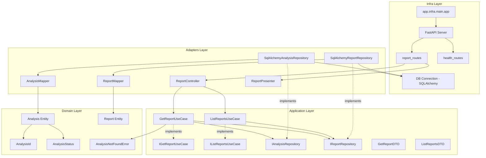
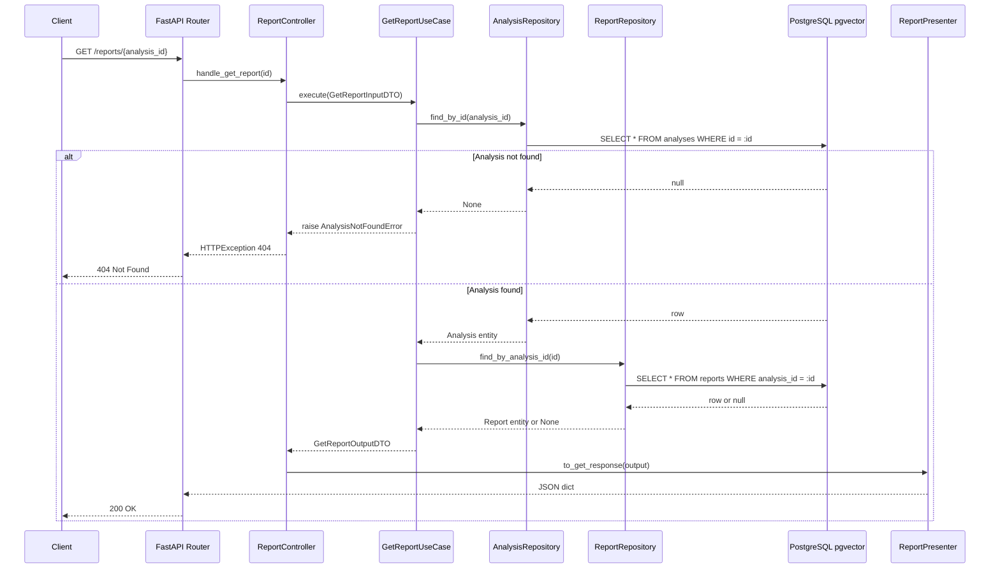
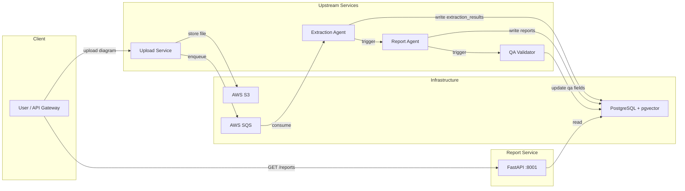
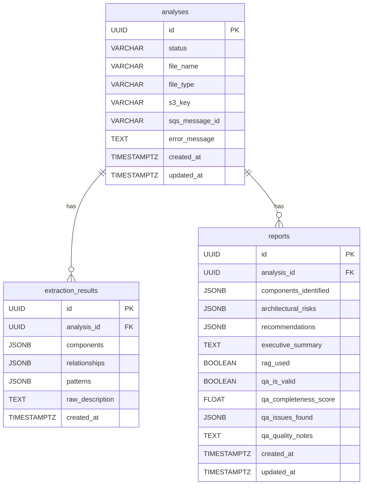
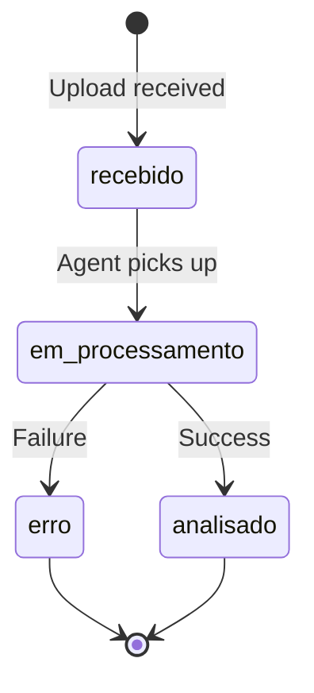
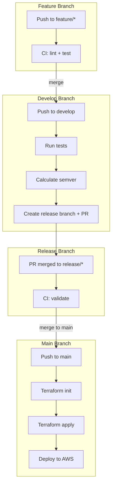

# report-api — API de Consulta de Relatórios 

API REST read-only para consulta dos relatórios de análise arquitetural gerados pelo `ia-service`. Integra-se ao API Gateway e ao `streamlit-app` do projeto FIAP Hackathon.

---
 
## Índice
 
1. [Descrição do Problema](#1-descrição-do-problema)
2. [Arquitetura Proposta](#2-arquitetura-proposta)
3. [Fluxo da Solução](#3-fluxo-da-solução)
4. [Instruções de Execução](#4-instruções-de-execução)

---

## 1. Descrição do Problema

Sistemas de análise arquitetural baseados em IA produzem relatórios complexos — riscos identificados, recomendações, métricas de qualidade — que precisam ser consumidos de forma confiável por múltiplos clientes (frontend, gateway, outros serviços). O desafio está em expor esses dados sem acoplar o mecanismo de consulta ao mecanismo de geração, e sem comprometer a integridade dos dados já persistidos.

**Contexto do ecossistema:**

| Serviço | Porta | Papel |
|---|---|---|
| `ia-service` | 8000 | Recebe diagramas, executa análise com IA + RAG, escreve relatórios no banco |
| `report-api` | 8001 | Lê e expõe relatórios (read-only) — este serviço |
| `streamlit-app` | — | Frontend que consome o `report-api` |

**Problema específico:** como estruturar o serviço de consulta de forma que regras de domínio, lógica de aplicação e detalhes de infraestrutura não se misturem, garantindo testabilidade e independência de frameworks?

---

## 2. Arquitetura Proposta

O serviço adota **Clean Architecture**, organizando o código em quatro camadas concêntricas com dependências que apontam sempre para o centro.

```
┌──────────────────────────────────────────────────────────┐
│  INFRA (Frameworks & Drivers)                            │
│  ┌────────────────────────────────────────────────────┐  │
│  │  ADAPTERS (Interface Adapters)                     │  │
│  │  ┌──────────────────────────────────────────────┐  │  │
│  │  │  APPLICATION (Use Cases)                     │  │  │
│  │  │  ┌────────────────────────────────────────┐  │  │  │
│  │  │  │  DOMAIN (Entities & Business Rules)    │  │  │  │
│  │  │  └────────────────────────────────────────┘  │  │  │
│  │  └──────────────────────────────────────────────┘  │  │
│  └────────────────────────────────────────────────────┘  │
└──────────────────────────────────────────────────────────┘
```

### Estrutura de Pastas

```
app/
├── main.py                              # Entry point (shim → infra/main/app.py)
│
├── domain/                              # Camada mais interna — zero dependências externas
│   ├── entities/
│   │   ├── analysis.py                  # Entidade Analysis (id, status, file_name…)
│   │   └── report.py                    # Entidade Report (componentes, riscos, QA…)
│   ├── value_objects/
│   │   ├── analysis_id.py               # UUID imutável com igualdade por valor
│   │   └── analysis_status.py           # Enum dos status válidos do domínio
│   └── exceptions/
│       ├── base.py                      # DomainException (base hierárquica)
│       └── analysis_not_found.py        # AnalysisNotFoundError (nomeado pelo negócio)
│
├── application/                         # Casos de uso — depende só do domínio
│   ├── ports/
│   │   ├── input/
│   │   │   ├── i_get_report_use_case.py    # Interface IGetReportUseCase
│   │   │   └── i_list_reports_use_case.py  # Interface IListReportsUseCase
│   │   └── output/
│   │       ├── i_analysis_repository.py    # Interface IAnalysisRepository
│   │       └── i_report_repository.py      # Interface IReportRepository
│   ├── use_cases/
│   │   ├── get_report_use_case.py       # Busca analysis + report, lança exceção se ausente
│   │   └── list_reports_use_case.py     # Lista paginada com dados de analysis
│   └── dto/
│       ├── get_report_dto.py            # GetReportInputDTO, ReportDTO, GetReportOutputDTO
│       └── list_reports_dto.py          # ListReportsInputDTO, ReportSummaryDTO, ListReportsOutputDTO
│
├── adapters/                            # Implementações das interfaces — depende de application
│   ├── mappers/
│   │   ├── analysis_mapper.py           # dict (SQL row) → Analysis entity
│   │   └── report_mapper.py             # dict (SQL row) → Report entity
│   ├── repositories/
│   │   ├── sqlalchemy_analysis_repository.py   # Implementa IAnalysisRepository
│   │   └── sqlalchemy_report_repository.py     # Implementa IReportRepository
│   ├── controllers/
│   │   └── report_controller.py         # Monta InputDTO, chama use case, trata exceções de domínio → HTTP
│   └── presenters/
│       └── report_presenter.py          # OutputDTO → dict JSON para a resposta HTTP
│
├── infra/                               # Camada mais externa — frameworks e drivers
│   ├── database/
│   │   └── connection.py               # Engine SQLAlchemy, pool, get_db, check_db_connection
│   ├── http/
│   │   ├── server.py                   # Instância FastAPI com lifespan e registro de routers
│   │   └── routes/
│   │       ├── health_routes.py        # GET /health
│   │       └── report_routes.py        # GET /reports e GET /reports/{id} — composition local
│   └── main/
│       └── app.py                      # Composition root: aquece o engine e cria o app
│
└── utils/
    └── logger.py                        # structlog JSON — preocupação transversal
```

### Princípios aplicados

| Princípio | Como se manifesta |
|---|---|
| **Regra de dependência** | Importações sempre apontam para o centro: `infra → adapters → application → domain` |
| **Inversão de dependência** | Use cases dependem de `IAnalysisRepository` (interface), não de `SqlAlchemyAnalysisRepository` (concreta) |
| **Separação de responsabilidade** | Controller extrai parâmetros; use case orquestra; mapper converte; presenter formata |
| **Domínio puro** | `domain/` não importa FastAPI, SQLAlchemy ou qualquer biblioteca externa |
| **Exceções semânticas** | `AnalysisNotFoundError` carrega o `analysis_id`; o controller a converte em HTTP 404 |

---

## 3. Fluxo da Solução

### GET /reports/{analysis_id}

```
HTTP Request
    │
    ▼
report_routes.py          ← extrai analysis_id do path, obtém Session via Depends
    │  monta controller
    ▼
ReportController          ← chama use case via interface IGetReportUseCase
    │  GetReportInputDTO(analysis_id)
    ▼
GetReportUseCase          ← orquestra: busca analysis, busca report
    │
    ├─► IAnalysisRepository.find_by_id()
    │       └─► SqlAlchemyAnalysisRepository
    │               └─► SELECT * FROM analyses WHERE id = :id
    │               └─► AnalysisMapper.to_domain(row) → Analysis entity
    │
    ├─► [AnalysisNotFoundError se analysis é None]
    │
    └─► IReportRepository.find_by_analysis_id()
            └─► SqlAlchemyReportRepository
                    └─► SELECT * FROM reports WHERE analysis_id = :id ORDER BY created_at DESC LIMIT 1
                    └─► ReportMapper.to_domain(row) → Report entity
    │
    ▼
GetReportOutputDTO        ← ReportDTO.from_entity(report) converte entidade → DTO
    │
    ▼
ReportPresenter           ← serializa DTO → dict JSON
    │
    ▼
HTTP Response 200
```

### GET /reports?limit=20&offset=0

```
HTTP Request
    │
    ▼
report_routes.py          ← extrai limit/offset dos query params
    │
    ▼
ReportController          ← chama use case via IListReportsUseCase
    │  ListReportsInputDTO(limit, offset)
    ▼
ListReportsUseCase
    │
    └─► IReportRepository.list_with_analysis(limit, offset)
            └─► SqlAlchemyReportRepository
                    └─► SELECT r.*, a.status, a.file_name, a.created_at
                            FROM reports r JOIN analyses a ON r.analysis_id = a.id
                            ORDER BY r.created_at DESC LIMIT :limit OFFSET :offset
    │
    ▼  [ReportSummaryDTO.from_row(row) para cada linha]
ListReportsOutputDTO
    │
    ▼
ReportPresenter           ← serializa lista de ReportSummaryDTO → dict JSON
    │
    ▼
HTTP Response 200
```

### Tratamento de erro

```
AnalysisNotFoundError (domain)
    └─► capturada em ReportController.handle_get_report()
            └─► raise HTTPException(status_code=404, detail=str(exc))
```

O domínio lança exceções nomeadas pelo negócio, sem conhecer HTTP. O controller faz a tradução na borda do adaptador.

---

## 4. Instruções de Execução

### Pré-requisitos

- Docker e Docker Compose instalados
- Python 3.12+ (apenas para execução local sem Docker)

### Variáveis de ambiente

| Variável | Padrão | Descrição |
|---|---|---|
| `POSTGRES_USER` | `hackathon` | Usuário do banco |
| `POSTGRES_PASSWORD` | `hackathon123` | Senha do banco |
| `POSTGRES_DB` | `hackathon_db` | Nome do banco |
| `POSTGRES_HOST` | `localhost` | Host do banco |
| `POSTGRES_PORT` | `5432` | Porta do banco |
| `LOG_LEVEL` | `INFO` | Nível de log (`DEBUG`, `INFO`, `WARNING`) |

### Opção 1 — Standalone com Docker (banco incluso)

Sobe o PostgreSQL com o schema inicializado e o `report-api` em um único comando:

```bash
docker compose -f docker-compose.standalone.yml up --build
```

A API estará disponível em `http://localhost:8001`.

### Opção 2 — Integrado ao ia-service

Se o `ia-service` já estiver rodando com o banco compartilhado:

```bash
docker compose up --build
```

O `report-api` conecta ao banco gerenciado externamente via rede Docker.

### Opção 3 — Desenvolvimento local (sem Docker)

```bash
# 1. Suba apenas o banco
docker compose -f docker-compose.standalone.yml up pgvector -d

# 2. Configure o ambiente Python
python -m venv .venv
source .venv/bin/activate        # Linux/macOS
# .venv\Scripts\activate         # Windows

pip install -r requirements.txt

# 3. Inicie a API com hot-reload
uvicorn app.main:app --reload --port 8001
```

### Verificar saúde

```bash
curl http://localhost:8001/health
# {"status": "healthy", "db": "connected"}
```

### Consultar relatórios

```bash
# Listar (paginado)
curl "http://localhost:8001/reports?limit=10&offset=0"

# Detalhe por ID
curl "http://localhost:8001/reports/550e8400-e29b-41d4-a716-446655440000"
```

### Resposta de exemplo — GET /reports/{analysis_id}

```json
{
  "analysis_id": "550e8400-e29b-41d4-a716-446655440000",
  "status": "analisado",
  "file_name": "diagrama.png",
  "created_at": "2026-04-02T21:30:00",
  "report": {
    "id": "7f3e9c00-...",
    "executive_summary": "A arquitetura apresenta baixo acoplamento entre serviços...",
    "components_identified": ["API Gateway", "Auth Service", "User DB"],
    "architectural_risks": [
      {
        "type": "SPOF",
        "description": "User DB sem réplica de leitura",
        "severity": "ALTO",
        "mitigation": "Adicionar réplica read-only com failover automático"
      }
    ],
    "recommendations": ["Configurar DLQ no SQS", "Implementar circuit breaker"],
    "rag_used": true,
    "qa_is_valid": true,
    "qa_completeness_score": 0.92,
    "qa_issues_found": [],
    "qa_quality_notes": "Relatório completo e consistente.",
    "created_at": "2026-04-02T21:30:05",
    "updated_at": "2026-04-02T21:30:05"
  }
}
```

### Documentação interativa

Com a API rodando, acesse:

- Swagger UI: `http://localhost:8001/docs`
- ReDoc: `http://localhost:8001/redoc`

---

## 5. Diagramas de Arquitetura

Diagramas Mermaid gerados por análise reversa do código-fonte. Renderizam nativamente no GitHub.

### 5.1 Arquitetura Interna — Camadas Hexagonais

Mostra as camadas Clean Architecture e direção de dependência.



### 5.2 Fluxo de Request — GET /reports/{analysis_id}

Ciclo completo com caminhos de sucesso e falha.



### 5.3 Visão Macro — Contexto no Ecossistema Distribuído

Posição do report-service no sistema ArchAnalyzer (inferido do schema e referências).



### 5.4 Schema do Banco — Diagrama ER



### 5.5 Máquina de Estados — Analysis



### 5.6 Pipeline CI/CD


