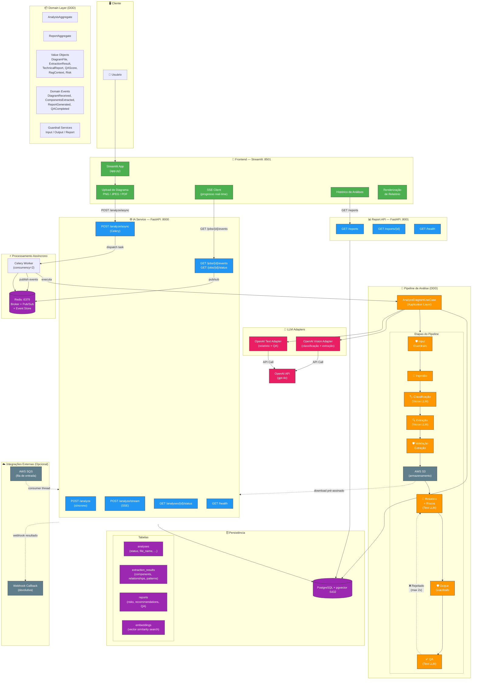
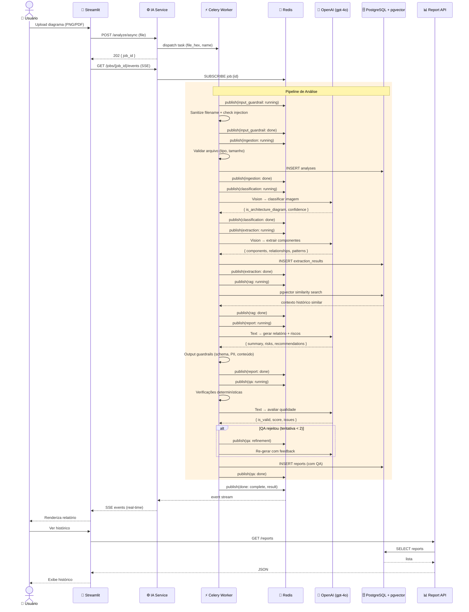
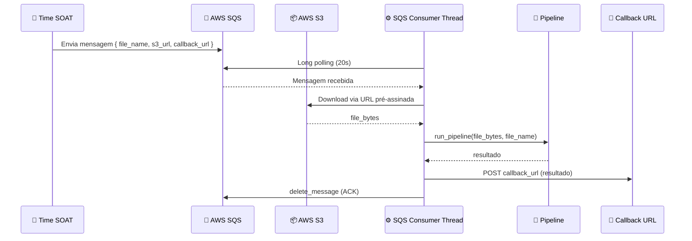
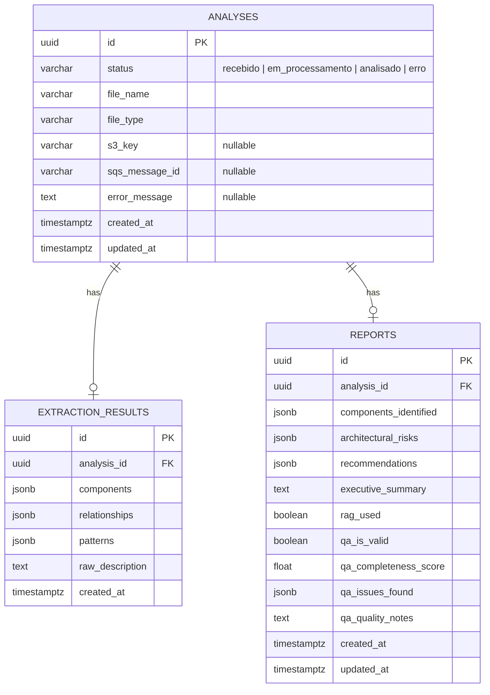

# Diagrama de Arquitetura — Hackathon FIAP

## Visão Geral do Sistema

## Fluxo Principal (Upload via Streamlit)

## Fluxo Alternativo (AWS SQS)

## Modelo de Dados

## Stack Tecnológica

| Camada | Tecnologia |
|--------|-----------|
| Frontend | Streamlit (Python) |
| Backend API | FastAPI + Uvicorn |
| Processamento Async | Celery + Redis (broker + pub/sub) |
| LLM | OpenAI gpt-4o (Vision + Text) |
| Vector Store / RAG | PostgreSQL + pgvector |
| Banco de Dados | PostgreSQL 16 |
| Mensageria (opcional) | AWS SQS + S3 |
| Containerização | Docker Compose (6 serviços) |
| Arquitetura | DDD (Domain-Driven Design) com Hexagonal/Ports & Adapters |
